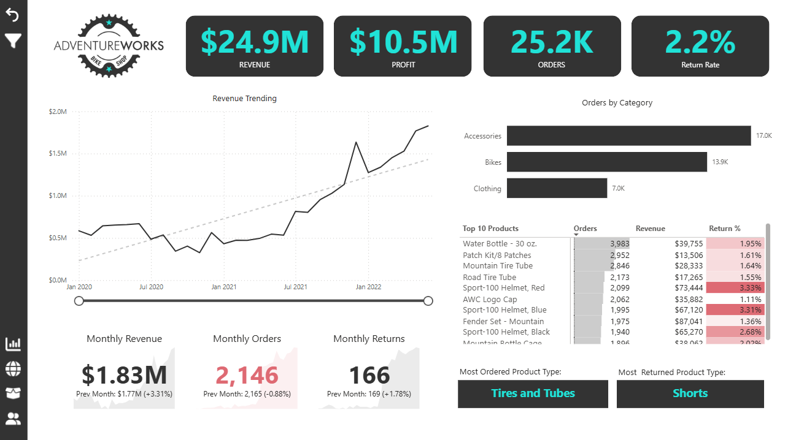
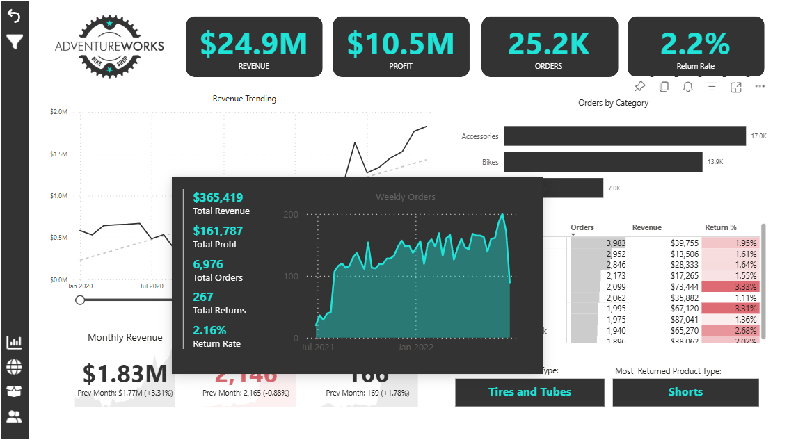
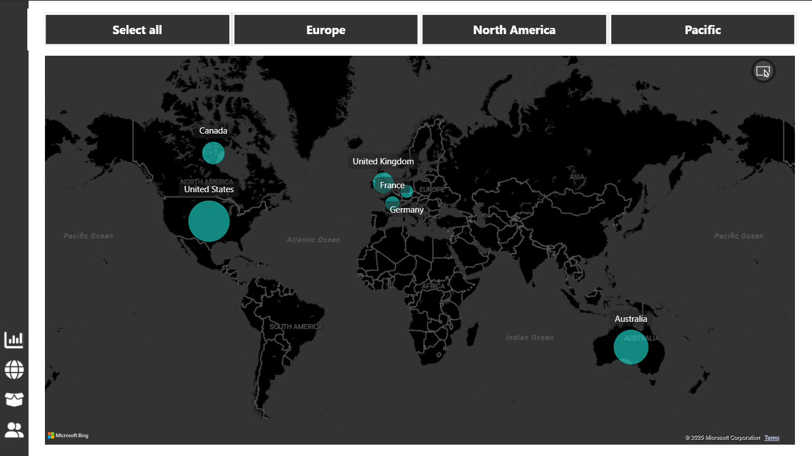
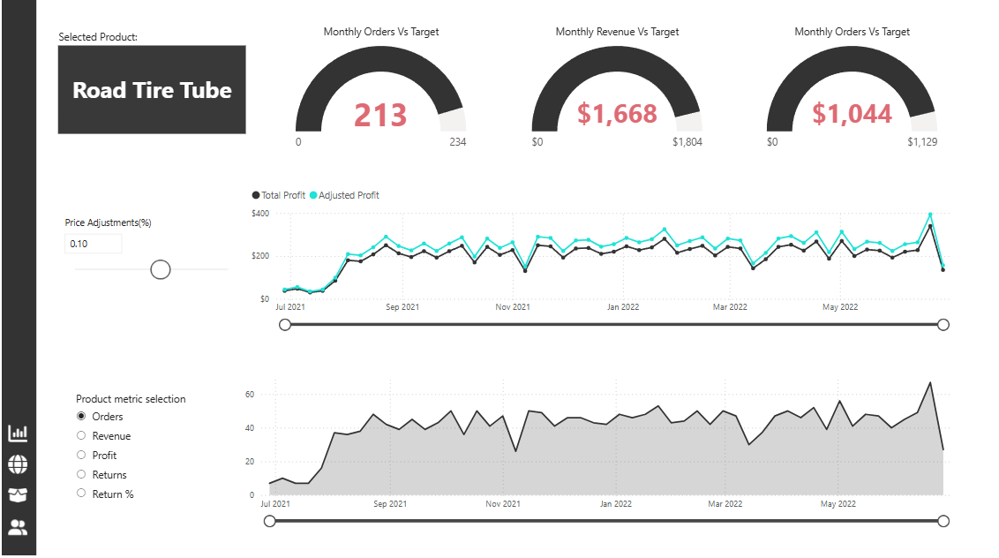
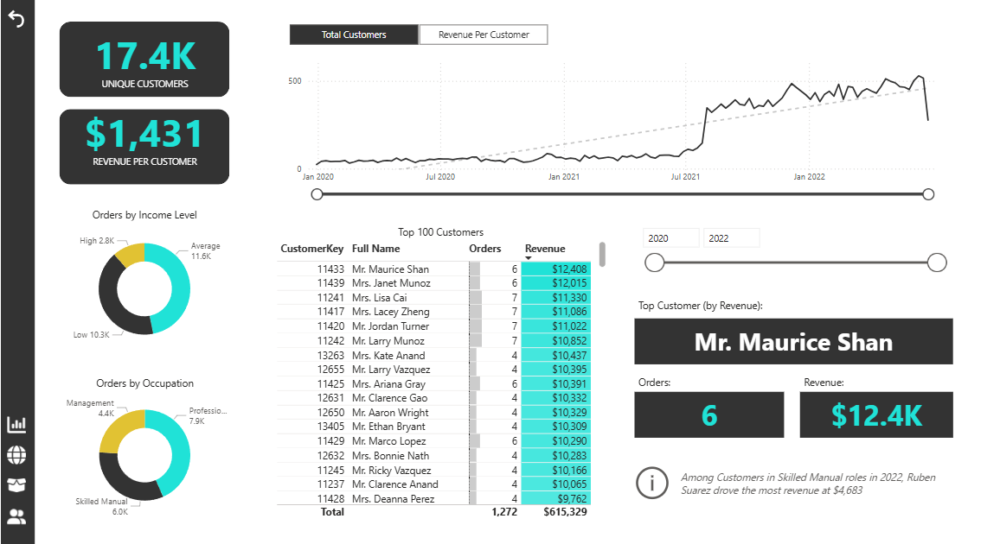

# Adventure Works Power BI Project

## Overview  
This repository contains the Power BI project developed for Adventure Works, a fictional global bicycle manufacturer and retailer. The project demonstrates end-to-end business intelligence capabilities, including data connection, transformation, modeling, and advanced visualization using Microsoft Power BI Desktop.

## Features  
- Connected and transformed complex datasets from multiple sources to create a unified data model.  
- Developed advanced DAX calculations to generate key business metrics such as sales trends, profit analysis, and customer segmentation.  
- Created interactive dashboards with drill-through navigation and dynamic filters to enable deep data exploration.  
- Implemented row-level security (RLS) to provide role-based data access and protect sensitive information.  
- Visualized revenue, orders, returns, and customer insights across different regions and product categories.

## Files Included  
- Power BI Desktop file (.pbix) with full report and data model  
- Data samples (if applicable) or links to official Adventure Works datasets  
- Supporting documentation and resources  

## How to Use  
1. Open the `.pbix` file in Power BI Desktop.  
2. Explore the interactive dashboards and filters to analyze sales, customer behavior, and product performance.  
3. Review DAX calculations in the model for understanding advanced metrics and measures.  
4. Modify the report or data model to fit your specific analysis needs.

## Learning Outcomes  
- Hands-on experience with the full Power BI workflow: data import, transformation, modeling, and visualization.  
- Mastery of advanced Power BI features including drill-through, DAX calculations, and row-level security.  
- Ability to deliver actionable business insights through compelling and interactive reports.

## Dashboard Screenshots

## Credits  
This project was completed as part of the Microsoft Power BI Desktop course by Maven Analytics.  
Special thanks to instructors Chris Dutton and Aaron Parry for their guidance.
