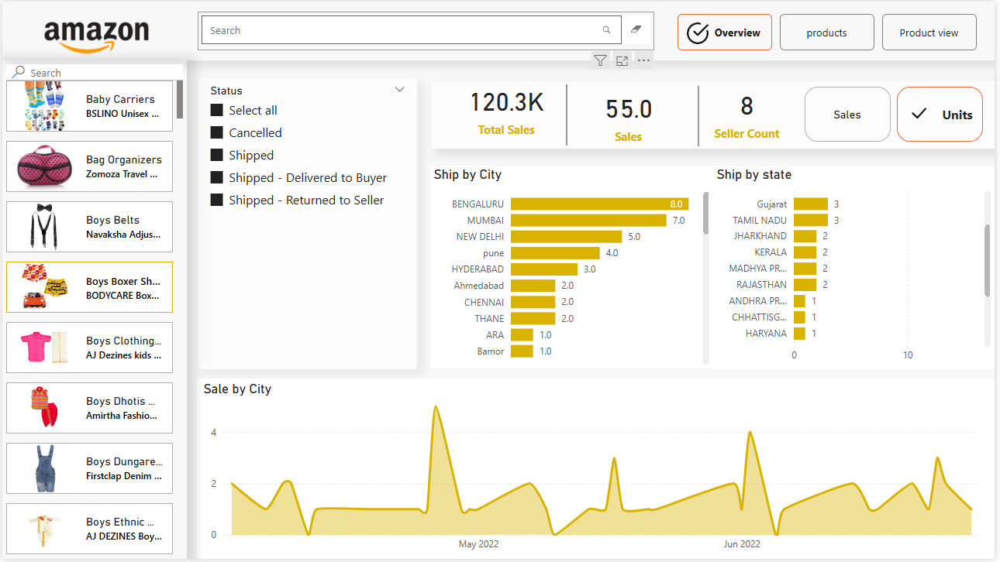
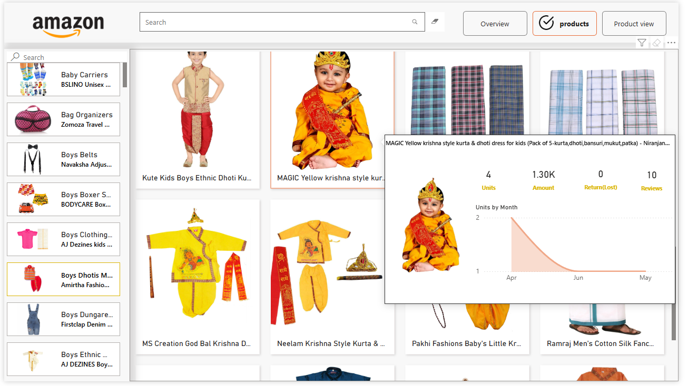
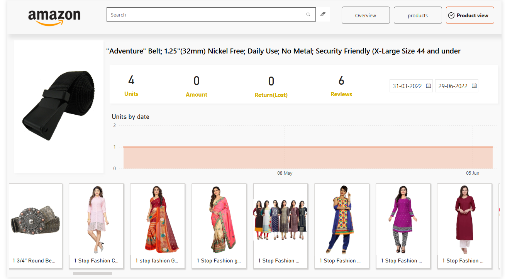

## Amazon Sales Insights Dashboard (Power BI)
This project features a comprehensive Amazon Sales Insights Dashboard built using Power BI, designed to visualize key metrics for product sales, regional performance, and customer feedback.

## 🚀 Features
Product Performance Analytics
Track units sold, total sales value, returns, and review counts for each product.

## Date-wise Trends
Visualize sales and unit movement across specific date ranges, enabling time-based performance comparisons.

## Regional Sales Breakdown

Analyze shipments by city and state to spot geographic trends and opportunities.

Quickly identify top-performing regions.

Customer Feedback
See aggregate product reviews to understand buyer sentiment.

## 📊 Key Visuals
Product Statistics: Instantly review units sold, total revenue, returns, and number of reviews.

Time Series Charts: Observe how sales fluctuate over weeks and months for targeted analysis.

Geographical Distribution: Bar and line charts reveal major shipping destinations at both city and state levels.

Product Gallery: Browse product images for quick identification and performance tracking.

## 🛠️ Technology Stack
Power BI: Visualization and reporting

## 📷 Example Screenshots
Below are actual screenshots of the dashboard summarizing different aspects of the Amazon sales data:

