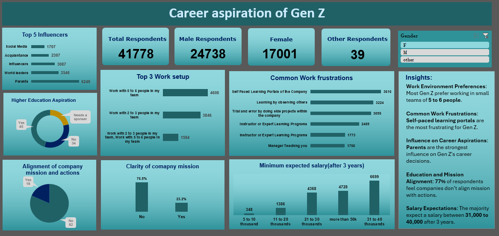

# Career Aspirations of Gen Z Dashboard

## 📋 Project Overview

This project was completed during my internship, where I conducted a comprehensive survey to understand the career aspirations, expectations, and preferences of Gen Z. Based on the collected data, I built an interactive dashboard to visualize the key insights and trends.

## 🚀 Features

- **Survey Data Analysis:** Analyzed responses from over 41,000+ Gen Z individuals.
- **Visualization:** Dynamic dashboard visualizing influencers, preferred work setups, common work frustrations, salary expectations, and more.
- **Key Metrics:** Highlights of demographic splits, education aspirations, mission alignment, and clarity.
- **Actionable Insights:** Summary of the most significant trends and takeaways for organizations seeking to hire or engage Gen Z.

## 🛠️ Tools & Technologies

- Data Collection: Survey Form (Google Forms)
- Data Analysis: Excel
- Visualization: Excel

## 📊 Dashboard Highlights

- **Top Influencers:** Parents are the #1 influence on career decisions.
- **Team Preferences:** Most Gen Z prefer working in teams of 5 to 6 people.
- **Frustrations:** Self-paced learning portals are the most common frustration.
- **Salary Expectations:** Majority expect a salary of 31,000 to 40,000 after 3 years.
- **Mission Alignment:** 77% feel company actions don’t align with the stated mission.

## 💡 Insights

- Employers can use these insights to tailor roles and environments to suit Gen Z preferences.
- Key recommendations are summarized in the dashboard for decision-makers.

## 📬 Contact

If you have any questions or feedback, feel free to reach out.

---

*Thank you for checking out this project!*
