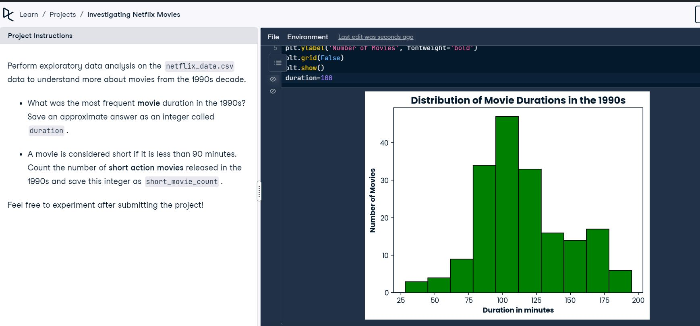
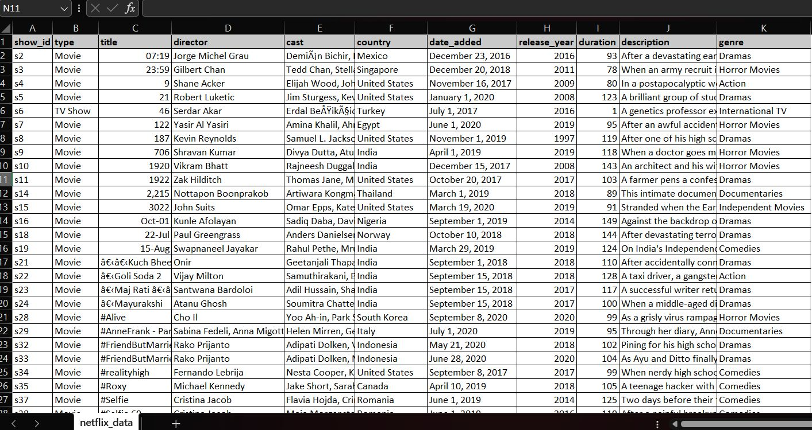
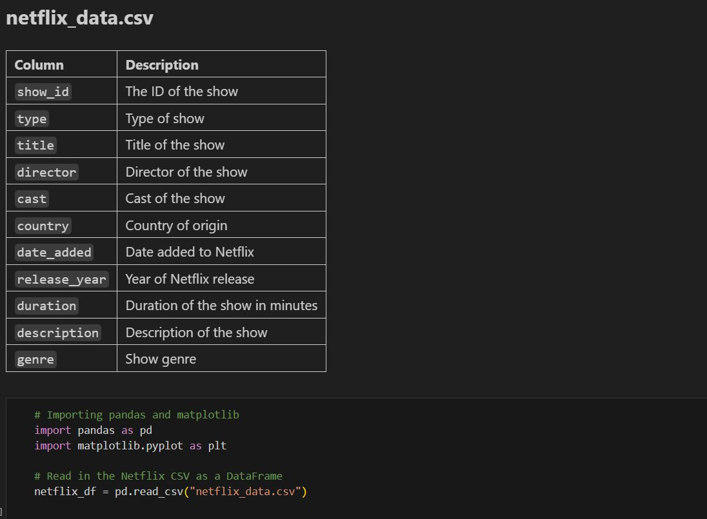
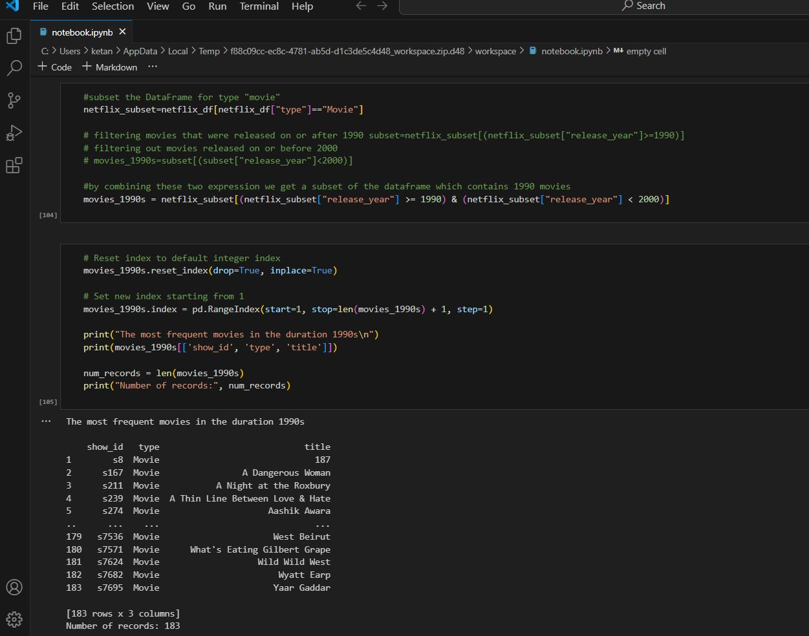
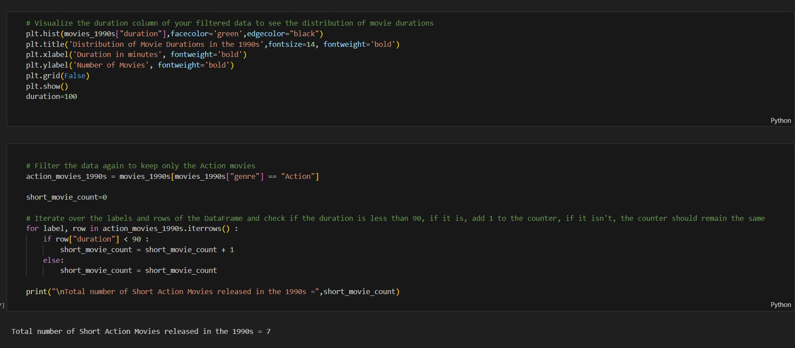

# Investigating Netflix Movies

This repository contains an exploratory data analysis project focused on Netflix movies from the 1990s. The analysis examines movie durations and short action movies using pandas and matplotlib in Python.

---

## Dataset: `netflix_data.csv`

The dataset contains information about titles on Netflix. Here are the columns and their descriptions:

| Column        | Description                              |
|---------------|------------------------------------------|
| show_id       | The ID of the show                       |
| type          | Type of show (Movie/TV Show)             |
| title         | Title of the show                        |
| director      | Director of the show                     |
| cast          | Cast of the show                         |
| country       | Country of origin                        |
| date_added    | Date added to Netflix                    |
| release_year  | Year of Netflix release                  |
| duration      | Duration of the show in minutes          |
| description   | Description of the show                  |
| genre         | Show genre                               |

---

## Project Objectives

- Perform exploratory data analysis (EDA) on movies from the 1990s
- Find the most frequent movie duration in the 1990s
- Count the number of short action movies (duration <90 minutes) released in the 1990s

---

## Instructions

### 1. Import Libraries
import pandas as pd
import matplotlib.pyplot as plt

### 2. Load the Dataset
netflix_df = pd.read_csv("netflix_data.csv")
---

### 3. Filter for Movies Released in the 1990s
netflix_subset = netflix_df[netflix_df["type"] == "Movie"]
movies_1990s = netflix_subset[
(netflix_subset["release_year"] >= 1990) &
(netflix_subset["release_year"] < 2000)
]
---

### 4. Analyze Movie Durations
#### Plot the distribution of durations
plt.hist(movies_1990s["duration"], bins=10, color='green')
plt.title('Distribution of Movie Durations in the 1990s', fontweight='bold')
plt.xlabel('Duration in minutes', fontweight='bold')
plt.ylabel('Number of Movies', fontweight='bold')
plt.grid(False)
plt.show()

### 5. Find the Most Frequent Duration

Based on the histogram, the most frequent value is:
duration = 100 # Most frequent duration observed

### 6. Count Short Action Movies
short_action_movies = movies_1990s[
(movies_1990s["duration"] < 90) &
(movies_1990s["genre"].str.contains("Action", case=False, na=False))
]
short_movie_count = len(short_action_movies)

