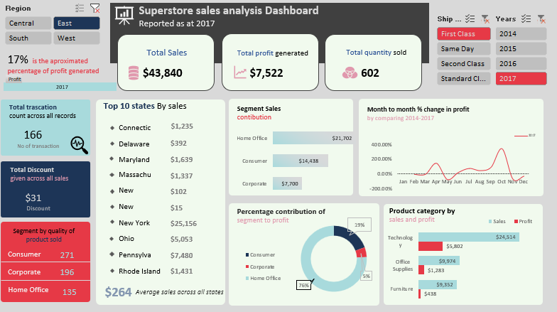

# Superstore Sales Analysis Dashboard (Excel)

## Overview

This repository contains an interactive **Superstore Sales Analysis Dashboard** created in Microsoft Excel. The dashboard visualizes key business metrics—sales, profit, quantity, discounts, and performance breakdowns—making it easy to analyze results by region, segment, year, shipping class, and product category.

## Features

- **Key Metrics:** Instantly view total sales ($43,840), total profit ($7,522), and quantity sold (602).
- **Regional Analysis:** Slice data by four primary regions—Central, East, South, and West.
- **Segment & Category Drilldown:** Examine sales and profit by customer segment (Consumer, Corporate, Home Office) and product categories (Technology, Office Supplies, Furniture).
- **Top States:** Find the 10 highest-revenue states at a glance.
- **Discount & Transactions:** Track total discounts ($31) and number of transactions (166).
- **Profit Analysis:** Analyze profit margins (17%) and month-to-month profit changes from 2014-2017.
- **Filters/Slicers:** Effortlessly filter results by year and shipping class.
- **Clean Design:** Dashboard layout featuring summary cards, charts, bar graphs, and pie charts for actionable insights.

## Getting Started

1. **Download** `Superstore_Sales_Dashboard.xlsx` from this repository.
2. **Open** the file in Microsoft Excel (2016 or later recommended).
3. **Enable editing and macros**, if prompted, for full interactivity.
4. **Use slicers and filters** on the dashboard to explore different business dimensions.
5. **Review insights** for better business decision-making and performance tracking.
   
## Customization

- Replace the sample data with your store’s actual transaction records for tailored analytics.
- Personalize dashboards by adding or modifying metrics, visuals, and color schemes to fit your brand or reporting needs.

## Requirements

- Microsoft Excel 2016 or newer

## License

For educational and demonstration purposes only.

---

*For questions or suggestions, please open an issue in this repository.*
